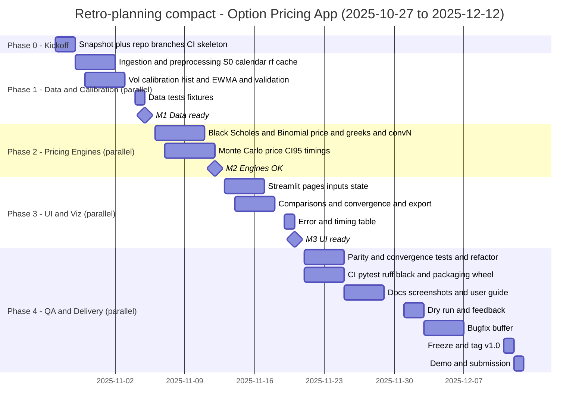

```mermaid
gantt
    title Retro-planning compact - Option Pricing App (2025-10-27 to 2025-12-12)
    dateFormat  YYYY-MM-DD

    section Phase 0 - Kickoff
    Snapshot plus repo branches CI skeleton               :s0, 2025-10-27, 2d

    section Phase 1 - Data and Calibration (parallel)
    Ingestion and preprocessing S0 calendar rf cache      :d1, 2025-10-29, 4d
    Vol calibration hist and EWMA and validation          :d2, 2025-10-30, 4d
    Data tests fixtures                                   :d3, 2025-11-04, 1d
    M1 Data ready                                         :milestone, m1, 2025-11-05, 0d

    section Phase 2 - Pricing Engines (parallel)
    Black Scholes and Binomial price and greeks and convN :p1, 2025-11-06, 5d
    Monte Carlo price CI95 timings                        :p2, 2025-11-07, 5d
    M2 Engines OK                                         :milestone, m2, 2025-11-12, 0d

    section Phase 3 - UI and Viz (parallel)
    Streamlit pages inputs state                          :u1, 2025-11-13, 4d
    Comparisons and convergence and export                :u2, 2025-11-14, 4d
    Error and timing table                                :u3, 2025-11-19, 1d
    M3 UI ready                                           :milestone, m3, 2025-11-20, 0d

    section Phase 4 - QA and Delivery (parallel)
    Parity and convergence tests and refactor             :q1, 2025-11-21, 4d
    CI pytest ruff black and packaging wheel              :q2, 2025-11-21, 4d
    Docs screenshots and user guide                       :q3, 2025-11-25, 4d
    Dry run and feedback                                  :q4, 2025-12-01, 2d
    Bugfix buffer                                         :q5, 2025-12-03, 4d
    Freeze and tag v1.0                                   :rel, 2025-12-11, 1d
    Demo and submission                                   :fin, 2025-12-12, 1d


```
