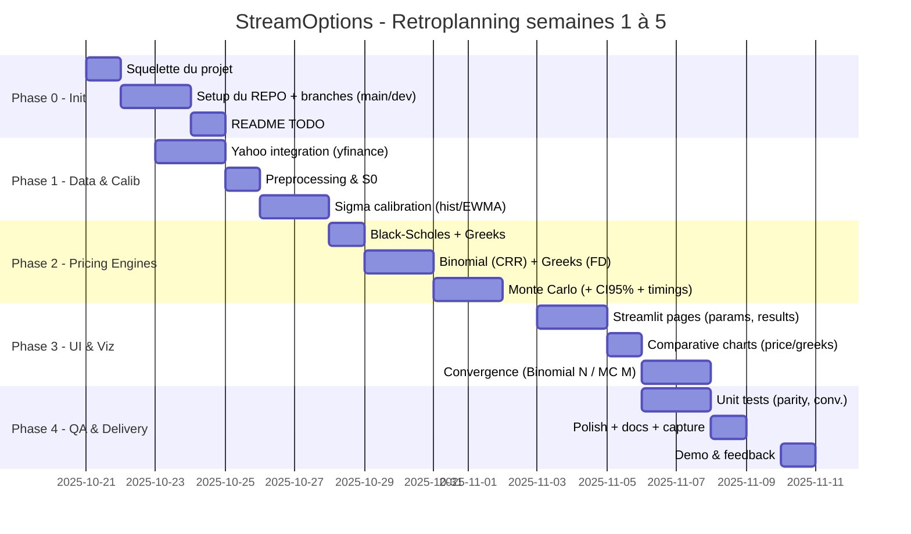

```mermaid
gantt
    title StreamOptions - Retroplanning semaines 1 à 5
    dateFormat  DD-MM-YYYY
    includes    weekends

    section Phase 0 - Init
    Squelette du projet                 :s1, 21-10-2025, 1d
    Setup du REPO + branches (main/dev) :s2, after s1, 2d
    README TODO                         :s3, after s2, 1d

    section Phase 1 - Data & Calib
    Yahoo integration (yfinance)        :d1, 23-10-2025, 2d
    Preprocessing & S0                  :d2, after d1, 1d
    Sigma calibration (hist/EWMA)       :d3, after d2, 2d

    section Phase 2 - Pricing Engines
    Black-Scholes + Greeks              :p1, 2025-10-28, 1d
    Binomial (CRR) + Greeks (FD)        :p2, after p1, 2d
    Monte Carlo (+ CI95% + timings)     :p3, after p2, 2d

    section Phase 3 - UI & Viz
    Streamlit pages (params, results)   :u1, 2025-11-03, 2d
    Comparative charts (price/greeks)   :u2, after u1, 1d
    Convergence (Binomial N / MC M)     :u3, after u2, 2d

    section Phase 4 - QA & Delivery
    Unit tests (parity, conv.)          :q1, 2025-11-06, 2d
    Polish + docs + capture             :q2, after q1, 1d
    Demo & feedback                     :dl, 2025-11-10, 1d
```
