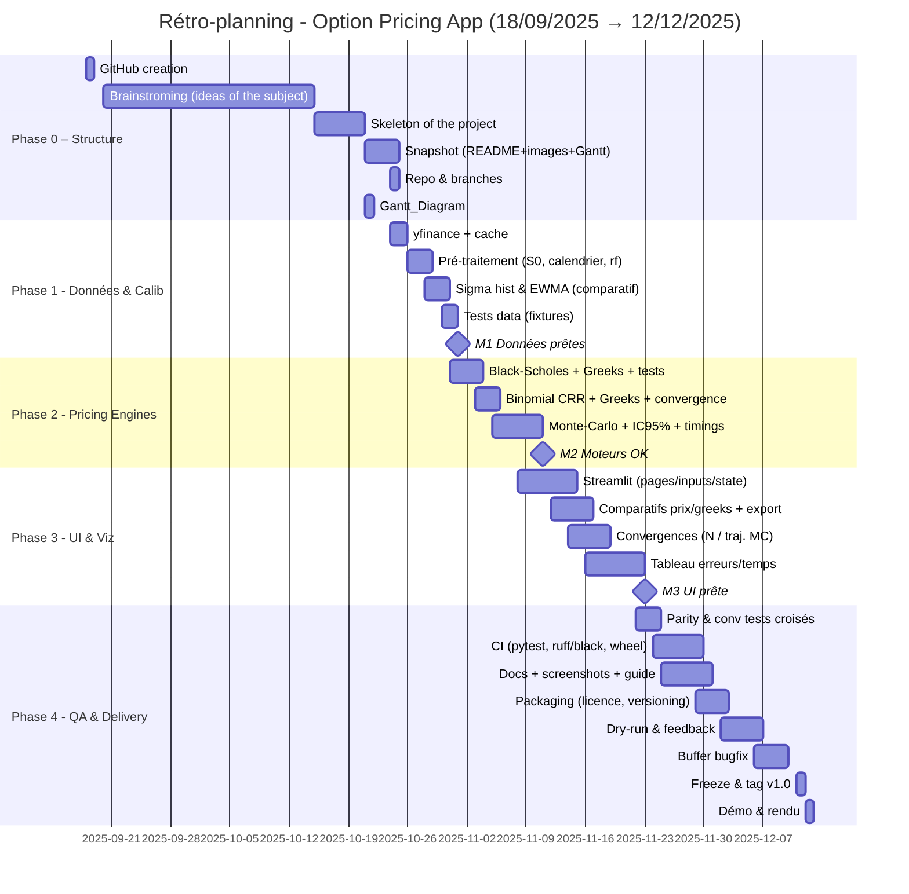

```mermaid
gantt
    title Rétro-planning - Option Pricing App (18/09/2025 → 12/12/2025)
    dateFormat  YYYY-MM-DD

    section Phase 0 – Structure 
    GitHub creation                     :s1, 2025-09-18, 1d
    Brainstroming (ideas of the subject):s2, 2025-09-20, 25d
    Skeleton of the project             :s3, 2025-10-15, 6d
    Snapshot (README+images+Gantt)      :s4, 2025-10-21, 4d
    Repo & branches                     :s5, 2025-10-24, 1d
    Gantt_Diagram                       :s6, 2025-10-21, 1d

    section Phase 1 - Données & Calib
    yfinance + cache                      :p1a, 2025-10-24, 2d
    Pré-traitement (S0, calendrier, rf)   :p1b, 2025-10-26, 3d
    Sigma hist & EWMA (comparatif)        :p1c, 2025-10-28, 3d
    Tests data (fixtures)                 :p1d, 2025-10-30, 2d
    M1 Données prêtes                     :milestone, m1, after p1d, 0d

    section Phase 2 - Pricing Engines
    Black-Scholes + Greeks + tests        :p2a, 2025-10-31, 4d
    Binomial CRR + Greeks + convergence   :p2b, 2025-11-03, 3d
    Monte-Carlo + IC95% + timings         :p2c, 2025-11-05, 6d
    M2 Moteurs OK                         :milestone, m2, after p2c, 0d

    section Phase 3 - UI & Viz
    Streamlit (pages/inputs/state)        :p3a, 2025-11-08, 7d
    Comparatifs prix/greeks + export      :p3b, 2025-11-12, 5d
    Convergences (N / traj. MC)           :p3c, 2025-11-14, 5d
    Tableau erreurs/temps                 :p3d, 2025-11-16, 7d
    M3 UI prête                           :milestone, m3, after p3d, 0d

    section Phase 4 - QA & Delivery
    Parity & conv tests croisés           :p4a, 2025-11-22, 3d
    CI (pytest, ruff/black, wheel)        :p4b, 2025-11-24, 6d
    Docs + screenshots + guide            :p4c, 2025-11-25, 6d
    Packaging (licence, versioning)       :p4d, 2025-11-29, 4d
    Dry-run & feedback                    :p4e, 2025-12-02, 5d
    Buffer bugfix                         :p4f, 2025-12-06, 4d
    Freeze & tag v1.0                     :rel, 2025-12-11, 1d
    Démo & rendu                          :fin, 2025-12-12, 1d


```
