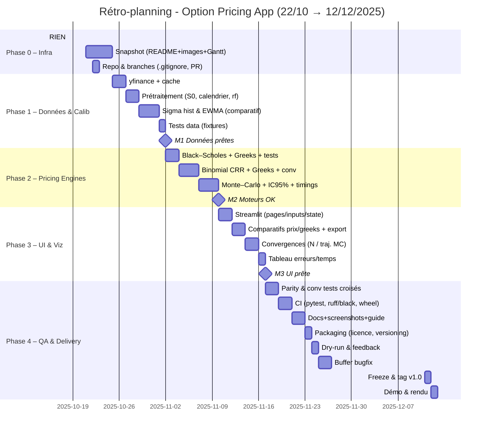

```mermaid
gantt
    title Rétro-planning - Option Pricing App (22/10 → 12/12/2025)
    dateFormat  YYYY-MM-DD
    %% aucune exclusion -> pas de bandes jaunes

    section Phase 0 – Infra
    RIEN                                :s1, 2025-10-15, 0d
    Snapshot (README+images+Gantt)      :s2, 2025-10-21, 4d
    Repo & branches (.gitignore, PR)    :s3, 2025-10-22, 1d

    section Phase 1 – Données & Calib
    yfinance + cache                     :d1, after s2, 2d
    Prétraitement (S0, calendrier, rf)   :d2, after d1, 2d
    Sigma hist & EWMA (comparatif)       :d3, after d2, 3d
    Tests data (fixtures)                :d4, after d3, 1d
    M1 Données prêtes                    :milestone, m1, after d4, 0d

    section Phase 2 – Pricing Engines
    Black–Scholes + Greeks + tests       :p1, after m1, 2d
    Binomial CRR + Greeks + conv         :p2, after p1, 3d
    Monte–Carlo + IC95% + timings        :p3, after p2, 3d
    M2 Moteurs OK                        :milestone, m2, after p3, 0d

    section Phase 3 – UI & Viz
    Streamlit (pages/inputs/state)       :u1, after m2, 2d
    Comparatifs prix/greeks + export     :u2, after u1, 2d
    Convergences (N / traj. MC)          :u3, after u2, 2d
    Tableau erreurs/temps                :u4, after u3, 1d
    M3 UI prête                          :milestone, m3, after u4, 0d

    section Phase 4 – QA & Delivery
    Parity & conv tests croisés          :q1, after m3, 2d
    CI (pytest, ruff/black, wheel)       :q2, after q1, 2d
    Docs+screenshots+guide               :q3, after q2, 2d
    Packaging (licence, versioning)      :q4, after q3, 1d
    Dry-run & feedback                   :q5, after q4, 1d
    Buffer bugfix                        :q6, after q5, 2d
    Freeze & tag v1.0                    :rel, 2025-12-11, 1d
    Démo & rendu                         :fin, 2025-12-12, 1d


```
