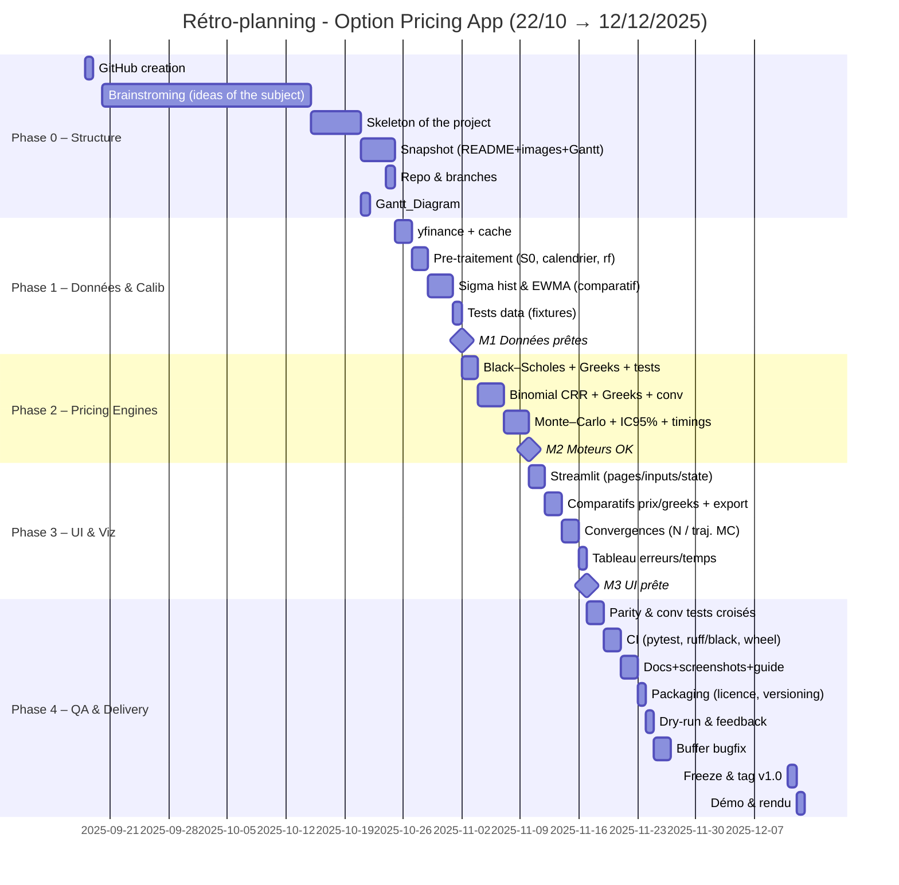

```mermaid
gantt
    title Rétro-planning - Option Pricing App (22/10 → 12/12/2025)
    dateFormat  YYYY-MM-DD

    section Phase 0 – Structure 
    GitHub creation                     :s1, 2025-09-18, 1d
    Brainstroming (ideas of the subject):s2, 2025-09-20, 25d
    Skeleton of the project             :s3, 2025-10-15, 6d
    Snapshot (README+images+Gantt)      :s4, 2025-10-21, 4d
    Repo & branches                     :s5, 2025-10-24, 1d
    Gantt_Diagram                       :s6, 2025-10-21, 1d

    section Phase 1 – Données & Calib
    yfinance + cache                     :d1, after s4, 2d
    Pre-traitement (S0, calendrier, rf)  :d2, after d1, 2d
    Sigma hist & EWMA (comparatif)       :d3, after d2, 3d
    Tests data (fixtures)                :d4, after d3, 1d
    M1 Données prêtes                    :milestone, m1, after d4, 0d

    section Phase 2 – Pricing Engines
    Black–Scholes + Greeks + tests       :p1, after m1, 2d
    Binomial CRR + Greeks + conv         :p2, after p1, 3d
    Monte–Carlo + IC95% + timings        :p3, after p2, 3d
    M2 Moteurs OK                        :milestone, m2, after p3, 0d

    section Phase 3 – UI & Viz
    Streamlit (pages/inputs/state)       :u1, after m2, 2d
    Comparatifs prix/greeks + export     :u2, after u1, 2d
    Convergences (N / traj. MC)          :u3, after u2, 2d
    Tableau erreurs/temps                :u4, after u3, 1d
    M3 UI prête                          :milestone, m3, after u4, 0d

    section Phase 4 – QA & Delivery
    Parity & conv tests croisés          :q1, after m3, 2d
    CI (pytest, ruff/black, wheel)       :q2, after q1, 2d
    Docs+screenshots+guide               :q3, after q2, 2d
    Packaging (licence, versioning)      :q4, after q3, 1d
    Dry-run & feedback                   :q5, after q4, 1d
    Buffer bugfix                        :q6, after q5, 2d
    Freeze & tag v1.0                    :rel, 2025-12-11, 1d
    Démo & rendu                         :fin, 2025-12-12, 1d


gantt
    title Diagramme de Gantt - Projet StreamOptions
    dateFormat  YYYY-MM-DD
    axisFormat %d/%m
    
    section Architecture & Setup
    Configuration environnement      :done,    env_setup, 2024-01-15, 3d
    Structure du projet              :done,    project_struct, 2024-01-18, 2d
    Pipeline CI/CD                   :done,    cicd_setup, 2024-01-20, 2d
    
    section Core - Data Layer
    Module IO & Cache (Ayoub)        :active,  data_io, 2024-01-22, 5d
    Normalisation données            :         data_norm, after data_io, 3d
    Tests Data Layer                 :         test_data, after data_norm, 2d
    
    section Méthodes de Pricing
    Black-Scholes (Esperance)        :         bs_impl, 2024-01-29, 6d
    Greeks Calculation               :         bs_greeks, after bs_impl, 4d
    Tests BS                         :         test_bs, after bs_greeks, 2d
    
    section Méthodes Numériques
    Binomial (Karam)                 :         binom_impl, 2024-02-05, 5d
    Monte Carlo (Karam)              :         mc_impl, 2024-02-12, 5d
    Convergence Analysis             :         convergence, after mc_impl, 3d
    
    section Interface Streamlit
    UI Structure                     :         ui_base, 2024-01-25, 4d
    Page Monte Carlo                 :         ui_mc, after mc_impl, 3d
    Page Black-Scholes               :         ui_bs, after bs_greeks, 3d
    Page Binomial                    :         ui_binom, after binom_impl, 3d
    
    section Intégration & Tests
    Intégration données-pricing      :         integration, 2024-02-19, 4d
    Tests d'intégration              :         test_integration, after integration, 3d
    Tests de performance             :         perf_test, after test_integration, 2d
    
    section Documentation & Finalisation
    Documentation technique          :         tech_docs, 2024-02-26, 4d
    Guide utilisateur                :         user_guide, after tech_docs, 3d
    Préparation présentation         :         presentation, 2024-03-04, 3d
    Revue finale                     :         final_review, 2024-03-07, 2d


```


