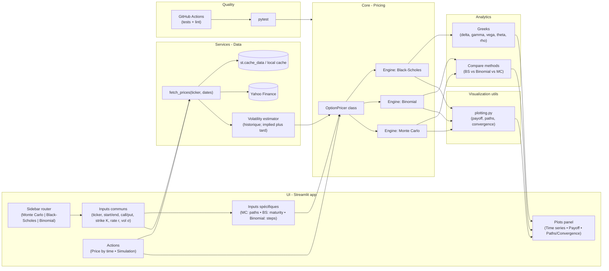
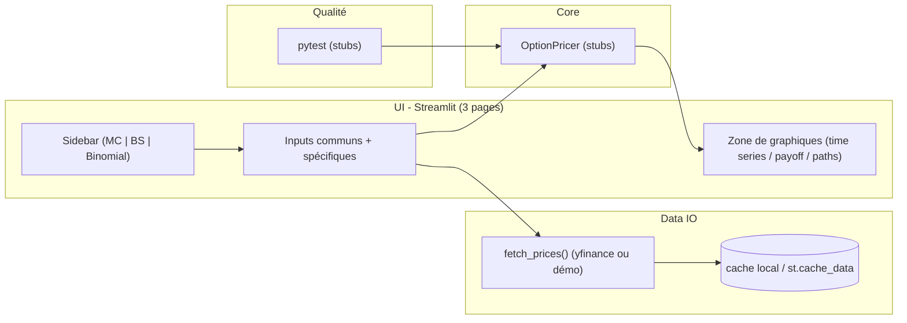

# Projet Logiciel Gr.5:" StreamOptions — Tarification d’options européennes (BS / Binomial / Monte-Carlo)"
Auteurs:
  - Ayoub MALOUM
  - Esperance DJOSSOU
  - Karam BENAMEUR

# 1) Nom du projet et idée du concept

**Nom du module** : `stream_options`  
**Idée** : Ce projet consiste à user de Streamlit pour calibrer et comparer le prix d’options européennes (call/put) via 3 différentes méthodes qui sont: Black-Scholes, Binomial et Monte-Carlo.
Suite à cela, sur le site on rendra possible l'analyse des écarts, Greeks, une étude des convergences et d'incertitude.

---

# 2) Objectifs et utilité

## 2.1 Objectif utilisateur
- Saisir un **ticker** (ex. `AAPL`), **strike K**, **échéance T**, **r**, **dividendes q** (ou 0).
- Récupérer les **données Yahoo Finance** (spot, historique, dividendes).
- **Calibrer σ** (vol historique simple ou EWMA) ou saisir une **vol implicite** manuelle.
- **Tarifer** l’option européenne **Call/Put** par **3 méthodes** : Black-Scholes (fermé), **Binomial CRR**, **Monte-Carlo**.
- Afficher **prix + Greeks (Δ, Γ, Θ, 𝑽, ρ)**, **écarts entre méthodes**, **temps de calcul**, **IC 95% MC**.
- Visualiser la **convergence** (Binomial: prix vs nombre de pas N; MC: prix & IC vs nombre de 
## 2.2 Hors-scope MVP
- Options américaines / exotiques, modèles de volatilité stochastique, scraping auto des volatilités implicites.

**Objectifs et utilité (alignés sur l’UI fournie).**  
L’application, structurée comme dans nos maquettes (sidebar **Monte Carlo Method**, **Black and Scholes Method**, **Binomial Method**), a un double but **pédagogique** et **pratique**. Depuis les mêmes **inputs** (ticker, période, call/put, **Strike Price**, **Discount Rate**, **Volatility**) et des champs **spécifiques** à chaque page (**Number of Simulation** pour Monte Carlo, **Maturity** pour Black-Scholes, **Steps** pour Binomial), l’utilisateur lance deux parcours : **Price by time** (graphique d’historique à gauche) pour visualiser et contextualiser le sous-jacent, puis **Simulation** (panneau de droite) pour calculer et afficher **prix** et **graphiques clés** (payoff, trajectoires MC, convergence avec #paths/#steps, puis Greeks sur BS). Cette mise en parallèle rend visibles les **hypothèses** (GBM, volatilité), les **compromis précision/temps de calcul** et la **cohérence entre méthodes**. Elle sert à **comparer** rapidement les approches, **explorer des scénarios** (variations de \(K, T, \sigma, r\)) et **choisir la méthode** adaptée au contexte. Les données sont **téléchargées de façon programmatique** (reproductibilité) et mises en cache pour une UX fluide. *Mid-term : le flux « Price by time » et le squelette des pages sont démontrés ; les calculs complets (prix/Greeks) sont finalisés pour le livrable final.*

# 3) Architecture du projet

## 3.1 Arborescence 

### Architecture (Mid-term)

UI → Core : les pages appellent les méthodes de pricing.

UI → Data : récupère les prix (avec cache).

Core → Greeks/Plots : calcule greeks, renvoie des objets/figures.

QA : tests locaux (pytest), exécutés automatiquement par GitHub Actions.

# 6) Tech stack et justifications

- **streamlit** — UI rapide et reproductible : construit la barre latérale et les 3 pages (Monte Carlo / Black-Scholes / Binomial) avec peu de code ; cache intégré (`st.cache_data`) pour éviter les rechargements.

- **numpy** — calcul numérique vectorisé : simulation des trajectoires GBM (Monte Carlo), opérations du modèle binomial, calcul efficace des intermédiaires de Black-Scholes (`d1`, `d2`).

- **pandas** — séries temporelles & préparation des données : gestion des prix historiques (index temps), resampling, rendements, estimation de volatilité glissante, traitement des manquants.

- **scipy** — statistiques & numérique fiables : `scipy.stats.norm.cdf/pdf` pour Black-Scholes ; `optimize` possible pour calibrer la volatilité implicite.

- **yfinance** — téléchargement programmatique des prix (reproductible) : récupère les données OHLCV par ticker/période, sans téléchargement manuel ; compatible avec le cache local.

- **matplotlib** — figures statiques pour le rapport : payoff call/put et courbes de convergence (prix vs. #pas/#trajectoires), export d’images vers `roadmap/pictures`.

- **plotly** — graphiques interactifs dans Streamlit : zoom, survol/infobulles pour l’historique des prix et les trajectoires Monte Carlo ; améliore l’explicabilité en démo.

- **pytest** — tests unitaires & non-régression : vérifie la convergence binomiale vers Black-Scholes, la monotonie en σ, et la gestion des erreurs ; base de la CI.

- **black / isort / flake8** — qualité & PEP8 : formatage auto (black), imports triés (isort) et linting (flake8) pour un code lisible et cohérent entre contributeurs.

- **numba** *(optionnel)* — accélération JIT : compile les boucles lourdes (MC / binomial) et peut apporter des gains ×5 à ×50 ; utile pour le critère “Time/Memory efficiency”.

