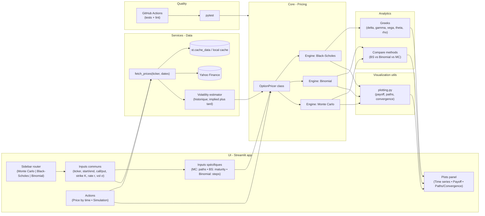
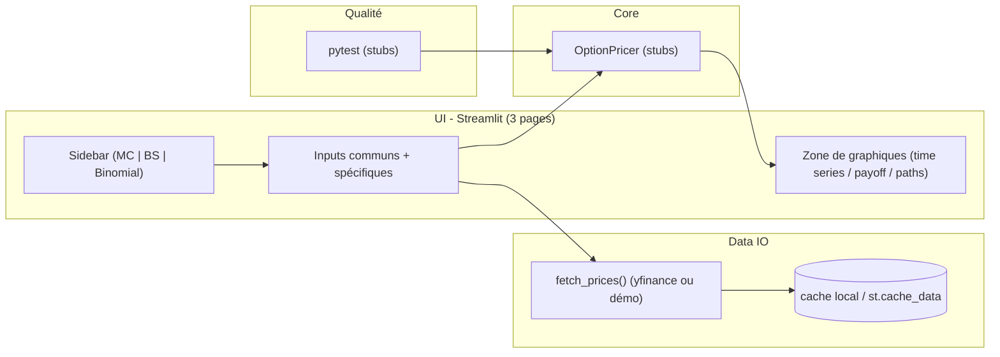

# Projet Logiciel Gr.5:" StreamOptions — Tarification d’options européennes (BS / Binomial / Monte-Carlo)"
Auteurs:
  - Ayoub MALOUM
  - Esperance DJOSSOU
  - Karam BENAMEUR

# 1) Nom du projet et idée du concept

**Nom du module** : `stream_options`  
**Idée** : Ce projet consiste à user de Streamlit pour calibrer et comparer le prix d’options européennes (call/put) via 3 différentes méthodes qui sont: Black-Scholes, Binomial et Monte-Carlo.
Suite à cela, sur le site on rendra possible l'analyse des écarts, Greeks, une étude des convergences et d'incertitude.

---

# 2) Objectifs et utilité

L’application, structurée comme dans nos maquettes (sidebar **Monte Carlo Method**, **Black and Scholes Method**, **Binomial Method**), a un double but **pédagogique** et **pratique**. Depuis les mêmes **inputs** (ticker, période, call/put, **Strike Price**, **Discount Rate**, **Volatility**) et des champs **spécifiques** à chaque page (**Number of Simulation** pour Monte Carlo, **Maturity** pour Black-Scholes, **Steps** pour Binomial), l’utilisateur lance deux parcours : **Price by time** (graphique d’historique à gauche) pour visualiser et contextualiser le sous-jacent, puis **Simulation** (panneau de droite) pour calculer et afficher **prix** et **graphiques clés** (payoff, trajectoires MC, convergence avec #paths/#steps, puis Greeks sur BS). Cette mise en parallèle rend visibles les **hypothèses** (GBM, volatilité), les **compromis précision/temps de calcul** et la **cohérence entre méthodes**. Elle sert à **comparer** rapidement les approches, **explorer des scénarios** (variations de \(K, T, \sigma, r\)) et **choisir la méthode** adaptée au contexte. Les données sont **téléchargées de façon programmatique** (reproductibilité) et mises en cache pour une UX fluide. *Mid-term : le flux « Price by time » et le squelette des pages sont démontrés ; les calculs complets (prix/Greeks) sont finalisés pour le livrable final.*

## 2.1 Comment ça se passe ?

### 1) Étapes communes (toutes les pages)
1. **Select Ticker** : entre le symbole (ex. `AAPL`, `BNP.PA`, `^GSPC`).
2. **Start date / End date** : choisis la période d’historique.
3. **Call or Put** : sélectionne le type d’option.
4. **Strike Price (K)** : saisis le strike.
5. **Discount Rate (r)** : taux sans risque (ex. `0.02` = 2%).
6. **Volatility (σ)** : valeur choisie ou issue d’une estimation (historique).
7. Clique **Price by time** pour afficher l’historique du sous-jacent (graphe de gauche).

**Recommandations**
- σ typique entre **0.10** et **0.60** ; r entre **0.00** et **0.05**.  
- Si tu n’es pas sûr de σ, commence par **Price by time**, observe la variabilité, puis ajuste.

---

### 2) Particularités par méthode (champs spécifiques)

- **Monte Carlo Method**
  - **Number of Simulation** : nombre de trajectoires (ex. 10 000 → 50 000).
  - *(optionnel)* **Seed** : pour reproduire exactement le résultat.
- **Black and Scholes Method**
  - **Maturity (T)** : maturité **en années** (ex. `0.5` = 6 mois).
  - (Greeks calculés à partir des mêmes entrées communes.)
- **Binomial Method**
  - **Steps** : nombre d’étapes de l’arbre (ex. 100 → 500).  
    Plus c’est grand, plus le prix **converge** vers Black-Scholes.

---

### 3) Ce que tu obtiens selon la méthode

- **Monte Carlo**
  - **Option price (MC)** + **IC 95%** (intervalle de confiance).
  - **Simulated paths** (trajectoires) et/ou **Convergence** (prix vs #paths).
  - **Payoff** à l’échéance.
- **Black-Scholes**
  - **Option price (BS)** (référence fermée).
  - **Greeks** : Delta, Gamma, Vega, Theta, Rho.
  - **Payoff** avec repère du strike.
- **Binomial**
  - **Option price (Binomial)**.
  - **Convergence** du prix quand **Steps** augmente (doit tendre vers BS).

> Dans tous les cas, le graphe **Price by time** (gauche) montre l’historique du sous-jacent pour contextualiser la période choisie.

---

### 4) Comment prendre une décision (playbook rapide)

1. **Valide les données** : via **Price by time**, vérifie que la période est cohérente (pas d’anomalies évidentes).
2. **Choisis/ajuste σ** :
   - Démarre avec une **vol historique** raisonnable (ex. 20%).
   - Ajuste σ jusqu’à obtenir une **cohérence** MC / Binomial / BS (écarts faibles).
3. **Compare les méthodes** :
   - **BS** = référence rapide pour une européenne sans dividendes.
   - **Binomial** = contrôle de **convergence** (augmente Steps si besoin).
   - **MC** = donne un **prix avec marge d’erreur** (IC 95%).
4. **Si tu as un prix de marché** (option chain) :
   - Si **Prix_modèle < Prix_marché** → option possiblement **surévaluée**.
   - Si **Prix_modèle > Prix_marché** → option possiblement **sous-évaluée**.
5. **Regarde les Greeks (BS)** :
   - **Delta** (exposition directionnelle), **Vega** (sensibilité à σ), **Theta** (érosion temps).
   - Choisis **K** et **T** selon ton risque/timing.
6. **Robustesse** :
   - **MC** : IC trop large → **augmente** le nombre de simulations.
   - **Binomial** : prix instable → **augmente** Steps jusqu’à stabilisation.

**Valeurs guidées**
- **Volatility (σ)** : 0.20 pour démarrer, puis ajuste.
- **Discount Rate (r)** : 0.02 (USD) / 0.01 (EUR) par défaut.
- **Maturity (T)** : 0.25 / 0.5 / 1.0 (trimestre / semestre / 1 an).
- **Number of Simulation (MC)** : 10 000 → 50 000.
- **Steps (Binomial)** : 100 → 500 (voire 1000 si besoin de stabilité).

# 3) Architecture du projet

## 3.1 Arborescence 

### Architecture (Mid-term)

UI → Core : les pages appellent les méthodes de pricing.

UI → Data : récupère les prix (avec cache).

Core → Greeks/Plots : calcule greeks, renvoie des objets/figures.

QA : tests locaux (pytest), exécutés automatiquement par GitHub Actions.

## 3.2 Pipeline 

### Vue d’ensemble (runtime)
1. **Entrées utilisateur** (communes) : *Ticker*, *Start/End*, *Call/Put*, *Strike K*, *Discount Rate r*, *Volatility σ*.  
2. **Fetch & préparation des données** : `fetch_prices()` → index UTC trié, `ret`/`logret`, cache `.parquet`.  
3. **Price by time** *(bouton gauche)* : on trace l’historique (Close) du sous-jacent.  
4. **Paramétrage** : on construit `OptionPricer(s0, K, r, σ, T, kind)` (avec `T` saisi sur la page BS, ou déduit).  
5. **Routing par page** :
   - **Monte Carlo** : lire **Number of Simulation** → `pricer.monte_carlo(paths)` → **prix MC + IC95%** → **trajectoires / convergence**.
   - **Black-Scholes** : lire **Maturity (T)** → `pricer.black_scholes()` → **prix BS** + **Greeks** → **payoff**.
   - **Binomial** : lire **Steps** → `pricer.binomial(steps)` → **prix binomial** → **convergence vers BS** quand Steps↑.
6. **Visualisation** : `utils/plotting.py` génère **Payoff**, **Paths/Convergence**, **Greeks** (si affichés).  
7. **Sorties** : afficher **prix**, **IC (MC)**, **Greeks (BS)**, et les graphiques ; enregistrer les figures (si besoin) dans `roadmap/pictures/`.  
8. **(Final)** Qualité : tests `pytest`, CI GitHub Actions, perf (temps/mémoire), doc auto.

# 4) Tech stack et justifications

- **streamlit** — UI rapide et reproductible : construit la barre latérale et les 3 pages (Monte Carlo / Black-Scholes / Binomial) avec peu de code ; cache intégré (`st.cache_data`) pour éviter les rechargements.

- **numpy** — calcul numérique vectorisé : simulation des trajectoires GBM (Monte Carlo), opérations du modèle binomial, calcul efficace des intermédiaires de Black-Scholes (`d1`, `d2`).

- **pandas** — séries temporelles & préparation des données : gestion des prix historiques (index temps), resampling, rendements, estimation de volatilité glissante, traitement des manquants.

- **scipy** — statistiques & numérique fiables : `scipy.stats.norm.cdf/pdf` pour Black-Scholes ; `optimize` possible pour calibrer la volatilité implicite.

- **yfinance** — téléchargement programmatique des prix (reproductible) : récupère les données OHLCV par ticker/période, sans téléchargement manuel ; compatible avec le cache local.

- **matplotlib** — figures statiques pour le rapport : payoff call/put et courbes de convergence (prix vs. #pas/#trajectoires), export d’images vers `roadmap/pictures`.

- **plotly** — graphiques interactifs dans Streamlit : zoom, survol/infobulles pour l’historique des prix et les trajectoires Monte Carlo ; améliore l’explicabilité en démo.

- **pytest** — tests unitaires & non-régression : vérifie la convergence binomiale vers Black-Scholes, la monotonie en σ, et la gestion des erreurs ; base de la CI.

- **black / isort / flake8** — qualité & PEP8 : formatage auto (black), imports triés (isort) et linting (flake8) pour un code lisible et cohérent entre contributeurs.

- **numba** *(optionnel)* — accélération JIT : compile les boucles lourdes (MC / binomial) et peut apporter des gains ×5 à ×50 ; utile pour le critère “Time/Memory efficiency”.

# 5) Bases de données (choix & pourquoi)

| Source / Base             | À quoi ça sert dans l’app (référence aux écrans)                                                | Pourquoi ce choix (mid-term)                          | Implémentation prévue |
|---|---|---|---|
| **Yahoo Finance** (via `yfinance`) | **Price by time** (graphe de gauche) ; donne le **prix spot S₀** et l’historique pour estimer une **volatilité historique** | Gratuit, simple, scriptable → reproductible           | `core/io.py::fetch_prices()` + cache `.parquet` |
| **Taux sans risque** (placeholder) | Champ **Discount Rate (r)** des 3 pages (valeur fixe mid-term)                         | Suffisant au mid-term ; API au **final**              | `core/io.py::risk_free_rate()` (USD→2%, EUR→1%) |
| *(Optionnel final)* **FRED/ECB**   | Remplacer **r** par un **taux de marché** (USD/EUR)                                     | Source officielle, API stable                         | `core/io.py::fetch_risk_free_*()` (final) |
| *(Optionnel final)* **Option chain** (yfinance) | Comparer **prix modèle** vs **prix marché** (sanity check)                         | Utile pour l’évaluation, pas requis mid-term          | `core/io.py::fetch_option_chain()` (final) |
| *(Optionnel)* **Calendrier boursier** (`pandas-market-calendars`) | Nettoyer les jours non-trading si besoin                                          | Pour éviter les trous de calendrier                    | `utils/dates.py` (final/si nécessaire) |

**Schéma des champs (Yahoo Finance)** : `Date (index UTC)`, `Open`, `High`, `Low`, `Close` (ou `Adj Close` → **Close**), `Volume`, `ret`, `logret`.  
**Suffixes utiles** : Euronext Paris = `.PA` (`BNP.PA`), indices parfois `^GSPC`, `^FCHI`, etc.  
**Reproductibilité** : pas de données brutes dans Git → **cache local** (`data/*.parquet`) + `st.cache_data` côté UI.

---
